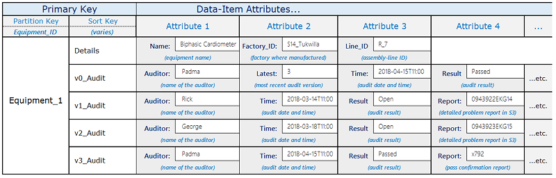

# DynamoDB Visual Design

Various pages of AWS documentation describe DynamoDB partition design, often with a visual aid similar to the following:

[Source][example_HR] ([archive][example_HR-archive])

[example_HR]: https://docs.aws.amazon.com/amazondynamodb/latest/developerguide/bp-modeling-nosql-B.html
[example_HR-archive]: http://web.archive.org/web/20200414130235if_/https://docs.aws.amazon.com/amazondynamodb/latest/developerguide/bp-modeling-nosql-B.html

Another example:

[Source][example_factory] ([archive][example_factory-archive])

[example_factory]: https://docs.aws.amazon.com/amazondynamodb/latest/developerguide/bp-sort-keys.html
[example_factory-archive]: http://web.archive.org/web/20200526232706/https://docs.aws.amazon.com/amazondynamodb/latest/developerguide/bp-sort-keys.html

This project attempts to recreate such a visual design, allowing table designers to interactively add partitions, items within partitions, attributes, and so on.

---

This repo doubles as a foray into frontend development with React. It could use significant improvement.

Also, at time of writing it doesn't compile. To be investigated and fixed.
